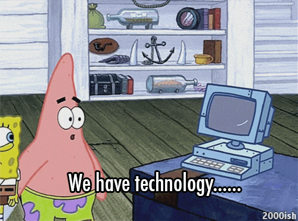

  
<strong>Full-Stack Developer</strong>

  
<strong>System Architecture & Backend‑focused</strong>

    

  

  

---

## About Me

  

 

- ⚙️ **Backend‑focused full‑stack** developer with a passion for **system architecture**
- 🐧 Deeply interested in **Linux**, **DevOps**, and **containerization (Docker)**
- 🪢 Currently working with **NestJS**, **Drizzle**, **PostgreSQL**
- 💬 Ask me about **backend design**, **API architecture**, or **system structure**

**I build scalable backends with NestJS + PostgreSQL.**  
Passionate about backend architecture, Linux, and containerization.  
A good backend = structure + performance + reproducibility.

---

## 🛠️ Technologies I Use

<strong>Programming language and framework</strong>

<table>
<tr>
<td align="center" width="100"> <b>Python</b></td>
<td align="center" width="100"> <b>JavaScript</b></td>
<td align="center" width="100"> <b>TypeScript</b></td>
<td align="center" width="100"> <b>Node.js</b></td>
</tr>
<tr>
<td align="center" width="100"> <b>React.js</b></td>
<td align="center" width="100"> <b>Next.js</b></td>
<td align="center" width="100"> <b>Express.js</b></td>
<td align="center" width="100"> <b>NestJS</b></td>
</tr>
</table>

 
 

<strong>DataBases & ORM</strong>

<table>
<tr>
<td align="center" width="100"> <b>Supabase</b></td>
<td align="center" width="100"> <b>MySQL</b></td>
<td align="center" width="100"> <b>FireBase</b></td>
<td align="center" width="100"> <b>PostgreSQL</b></td>
</tr>

<tr>
<td align="center" width="100"> <b>MongoDB</b></td>
<td align="center" width="100"> <b>Redis</b></td>
<td align="center" width="100"> <b>Prisma</b></td>
<td align="center" width="100">
 <b>Drizzle</b></td>
</tr>
</table>

 
 

<strong>DevOps & Core Tools</strong>

<table><tr>
<td align="center" width="100"> <b>Git</b></td>
<td align="center" width="100"> <b>GitHub</b></td>
<td align="center" width="100"> <b>Docker</b></td>
<td align="center" width="100"> <b>Linux</b></td>
</tr></table>

 
 

<strong>Advanced</strong>

<table><tr>
<td align="center" width="100"> <b>GraphQL</b></td>
<td align="center" width="100"> <b>WebSocket</b></td>
<td align="center" width="100"> <b>Vitest</b></td>
<td align="center" width="100"> <b>Zod</b></td>
</tr></table>

---

## 🧩 Collaborative Project

### 🚗 Car Rental System

**Role:** Collaborator (Backend & System Architecture)

---

## 📊 GitHub Statistics

  
   
  <strong>Profile Stats</strong>

 

  
   
  <strong>Contribution Streak</strong>

 

  

---

## 📬 Contact Me

Feel free to reach out for collaboration, questions, or just to say hi 👋

  
  &nbsp;&nbsp;
  
  &nbsp;&nbsp;
  
&nbsp;&nbsp;
  

  Or just message me on:  

📧 <a href="mailto:homow_dev@proton.me">Email</a>: homow_dev@proton.me 
📱 <a href="https://t.me/homow_dev">Telegram</a>: @homow_dev 
📞 <a href="https://wa.me/989210629512">WhatsApp</a>: +98 921 062 9512 
📟 <a href="https://www.instagram.com/homow_dev">Instagram</a>: homow_dev

